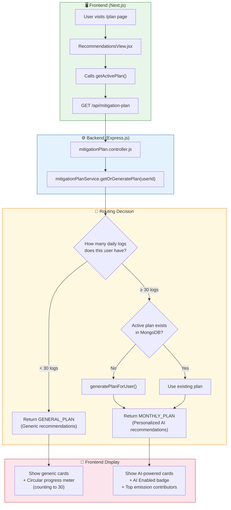
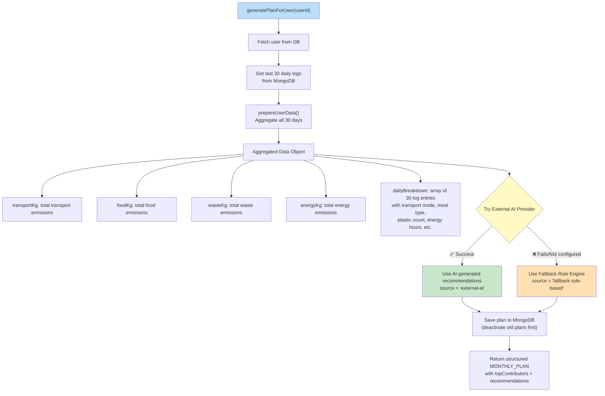
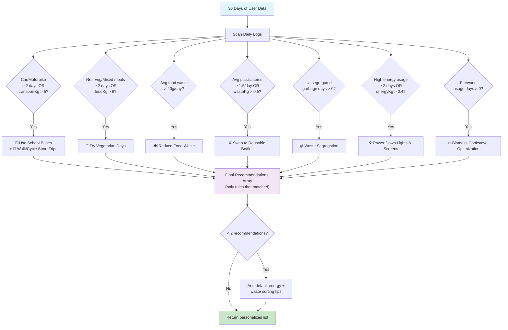
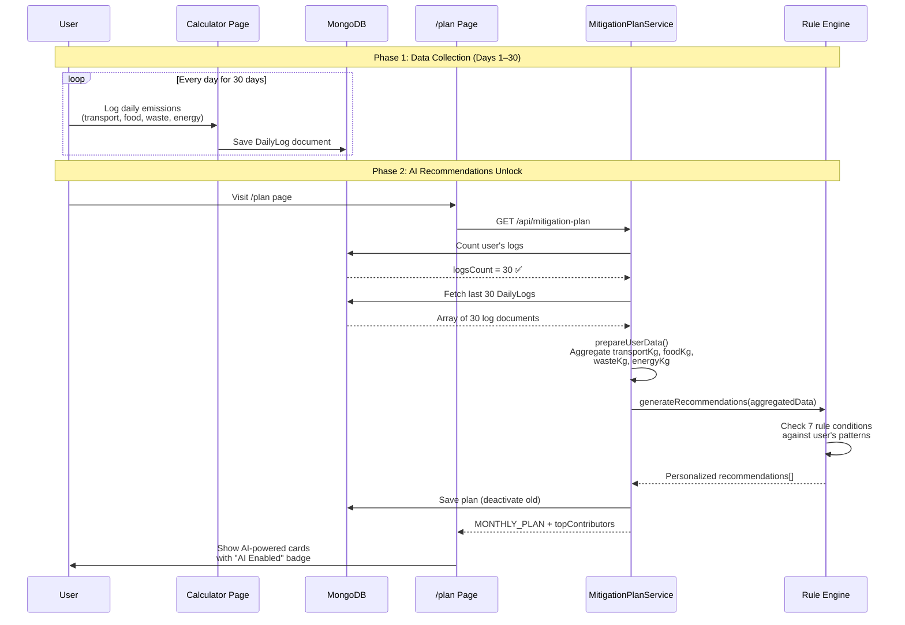
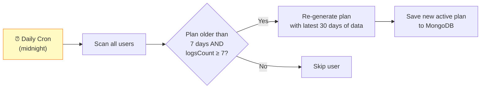

# AI Recommendation System — Flow Diagram

## 1. High-Level Architecture

---

## 2. Plan Generation Pipeline (≥ 30 Logs)

This is what happens inside `generatePlanForUser()` when a user qualifies for personalized recommendations:

---

## 3. Expert Rule Engine (Fallback AI)

The [fallbackRuleProvider.js](file:///d:/new%20Neokarma/NeoKarma/backend/src/services/ai/fallbackRuleProvider.js) analyzes the user's **actual daily log data** and fires rules based on patterns it detects:

> [!IMPORTANT]
> Each recommendation includes **personalized numbers** calculated from the user's actual data. For example:
> - `"We detected private car/motorbike commute on 18 days"` — real count from logs
> - `"-4 kg CO2 /week"` — calculated as `transportKg × 0.45`
> - Badge dynamically set to `HIGH IMPACT` or `MEDIUM IMPACT` based on emission magnitude

---

## 4. Data Flow: Daily Log → Recommendation

---

## 5. Refresh Cycle (Cron Job)

> [!NOTE]
> The cron currently re-generates every **7 days**. This means a user with 30+ logs will get their recommendations **refreshed weekly** with the latest 30 days of data, so the AI adapts as their habits change.

---

## 6. Summary Table

| Stage | What Happens | Key File |
|---|---|---|
| **User logs daily** | Transport, food, waste, energy data saved to `DailyLog` collection | Calculator page → `dailyLog.controller.js` |
| **User visits /plan** | Frontend calls `GET /api/mitigation-plan` | [RecommendationsView.jsx](file:///d:/new%20Neokarma/NeoKarma/frontend/src/components/RecommendationsView.jsx#L263-L325) |
| **< 30 logs** | Backend returns `GENERAL_PLAN` with generic tips | [mitigationPlan.service.js](file:///d:/new%20Neokarma/NeoKarma/backend/src/services/mitigationPlan.service.js#L164-L236) |
| **≥ 30 logs** | Backend aggregates 30 days of data → runs rule engine → returns `MONTHLY_PLAN` | [mitigationPlan.service.js](file:///d:/new%20Neokarma/NeoKarma/backend/src/services/mitigationPlan.service.js#L31-L89) |
| **Rule engine** | 7 conditional rules analyze patterns in user's actual log data | [fallbackRuleProvider.js](file:///d:/new%20Neokarma/NeoKarma/backend/src/services/ai/fallbackRuleProvider.js#L14-L243) |
| **Auto-refresh** | Cron job regenerates stale plans (> 7 days old) daily at midnight | [mitigationPlan.service.js](file:///d:/new%20Neokarma/NeoKarma/backend/src/services/mitigationPlan.service.js#L366-L392) |
| **Frontend display** | `< 30` → progress meter + generic cards · `≥ 30` → AI badge + personalized cards | [RecommendationsView.jsx](file:///d:/new%20Neokarma/NeoKarma/frontend/src/components/RecommendationsView.jsx#L391-L432) |
